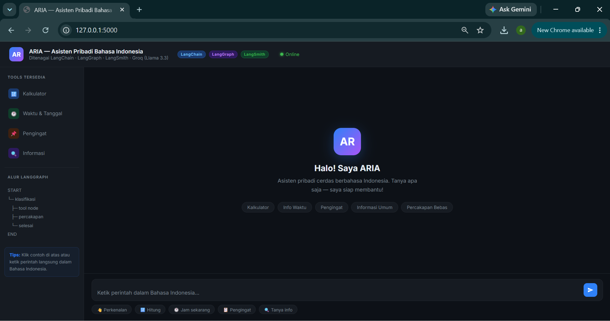
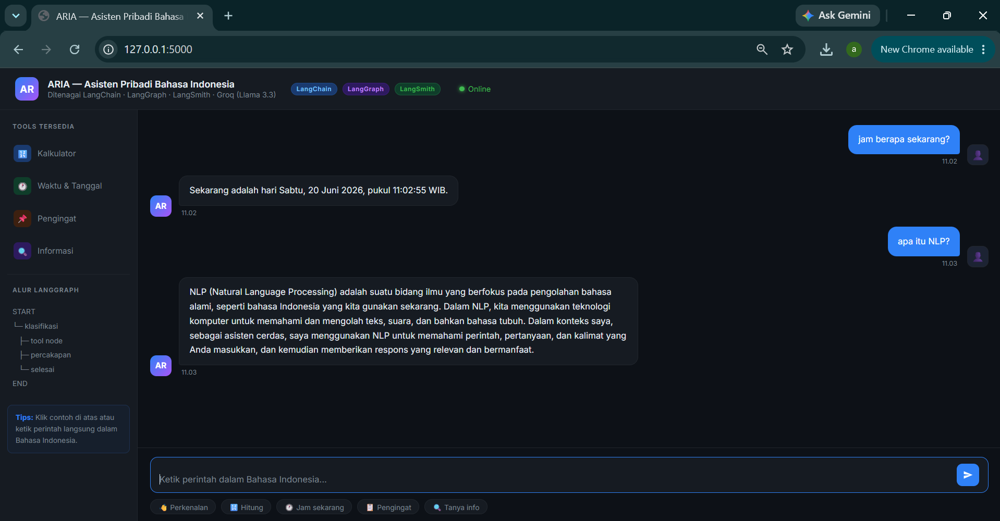
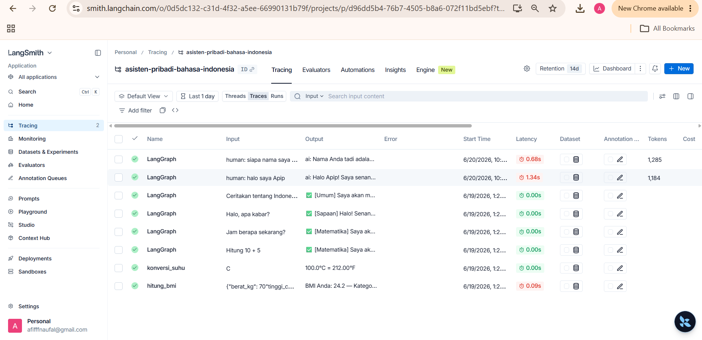

# 🤖 ARIA — Asisten Responsif Indonesia dengan AI

## Deskripsi Project

ARIA (Asisten Responsif Indonesia dengan AI) merupakan aplikasi chatbot berbasis Natural Language Processing (NLP) dan Large Language Model (LLM) yang dirancang untuk memahami perintah dalam Bahasa Indonesia secara natural. Sistem ini dibangun menggunakan tiga teknologi utama yaitu LangChain, LangGraph, dan LangSmith.

Pengguna dapat berinteraksi melalui antarmuka web dan memberikan perintah seperti menghitung operasi matematika, menampilkan waktu saat ini, mengelola pengingat, maupun memperoleh informasi umum. Sistem akan memproses input pengguna, menentukan jenis perintah, kemudian menjalankan alur yang sesuai menggunakan LangGraph.

Project ini dibuat sebagai implementasi praktis penggunaan LangChain, LangGraph, dan LangSmith pada mata kuliah Natural Language Processing (NLP)

# Fitur

### 🔢 Kalkulator

Menghitung ekspresi matematika sederhana dalam Bahasa Indonesia.

### ⏰ Informasi Waktu

Menampilkan tanggal dan waktu saat ini.

### 📌 Pengingat

Menambahkan dan menampilkan daftar pengingat pengguna.

### 💬 Percakapan Natural

Menjawab pertanyaan dan melakukan percakapan dalam Bahasa Indonesia.

### 🌐 Web Interface

Antarmuka chatbot berbasis Flask yang mudah digunakan.

### 📊 Monitoring

Tracing dan monitoring seluruh proses menggunakan LangSmith.


# Implementasi LangChain

Pada project ini LangChain digunakan sebagai fondasi utama untuk berinteraksi dengan model bahasa.

Komponen LangChain yang digunakan:

* ChatGroq
* Prompt Engineering
* HumanMessage
* AIMessage
* SystemMessage
* Tool Decorator (`@tool`)
* Tool Binding
* LLM Invocation

Peran LangChain:

* Menghubungkan aplikasi dengan model LLM Groq
* Mengelola prompt sistem
* Mengelola percakapan pengguna
* Mendefinisikan tool yang dapat dipanggil oleh sistem

---

# Implementasi LangGraph

LangGraph digunakan untuk mengatur alur pemrosesan perintah pengguna melalui pendekatan StateGraph.

Node yang digunakan:

* `node_klasifikasi`
* `node_proses_tool`
* `node_percakapan`
* `node_selesai`

Alur graph:

START → Klasifikasi → Routing → Tool / Percakapan / Selesai → END

Fungsi LangGraph:

* Mengklasifikasikan jenis perintah
* Menentukan alur yang harus dijalankan
* Mengelola state antar node
* Membuat workflow chatbot lebih terstruktur

---

# Implementasi LangSmith

LangSmith digunakan untuk monitoring dan tracing proses eksekusi aplikasi.

Fitur yang digunakan:

* Trace Monitoring
* Request Logging
* Debugging Workflow
* Performance Tracking

Manfaat LangSmith:

* Memantau proses setiap node
* Mengetahui penggunaan token
* Membantu proses debugging
* Melihat performa sistem secara real-time

---

# Cara Instalasi

### 1. Clone Repository

```bash
git clone https://github.com/USERNAME/uas-nlp-aria.git
cd uas-nlp-aria
```

### 2. Install Dependency

```bash
pip install -r requirements.txt
```

### 3. Konfigurasi Environment

Buat file `.env`

```env
GROQ_API_KEY=your_groq_api_key
LANGCHAIN_API_KEY=your_langsmith_api_key
LANGCHAIN_TRACING_V2=true
LANGCHAIN_PROJECT=ARIA-UAS-NLP
```

---

# Cara Menjalankan

Jalankan aplikasi:

```bash
python src/app.py
```

Kemudian buka browser:

```text
http://localhost:5000
```

---

# Screenshot Hasil Program

## 1. Tampilan Utama ARIA

Tampilan awal aplikasi ARIA yang menampilkan antarmuka chatbot, daftar tools, serta integrasi LangChain, LangGraph, dan LangSmith.



---

## 2. Demo Percakapan Chatbot

Contoh interaksi pengguna dengan ARIA untuk menampilkan informasi waktu dan menjawab pertanyaan mengenai NLP.



---

## 3. Monitoring dan Tracing Menggunakan LangSmith

Dashboard LangSmith yang digunakan untuk melakukan monitoring, tracing, logging, dan evaluasi performa aplikasi.



# Struktur Folder

```text
uas-nlp-aria/
│
├── src/
│   ├── app.py
│   ├── asisten.py
│   ├── demo_langchain_langgraph.py
│   └── demo_langsmith.py
│
├── screenshots/
│   ├── home.png
│   ├── chat_demo.png
│   └── langsmith_dashboard.png
│
├── docs/
│
├── requirements.txt
├── .env.example
├── .gitignore
└── README.md
```


Nama : Mohd Afif Naufal

NPM  : 233510518

Mata Kuliah : Praktikum Natural Language Processing (NLP)

Ujian Akhir Semester (UAS)

Project : ARIA — Asisten Responsif Indonesia dengan AI
